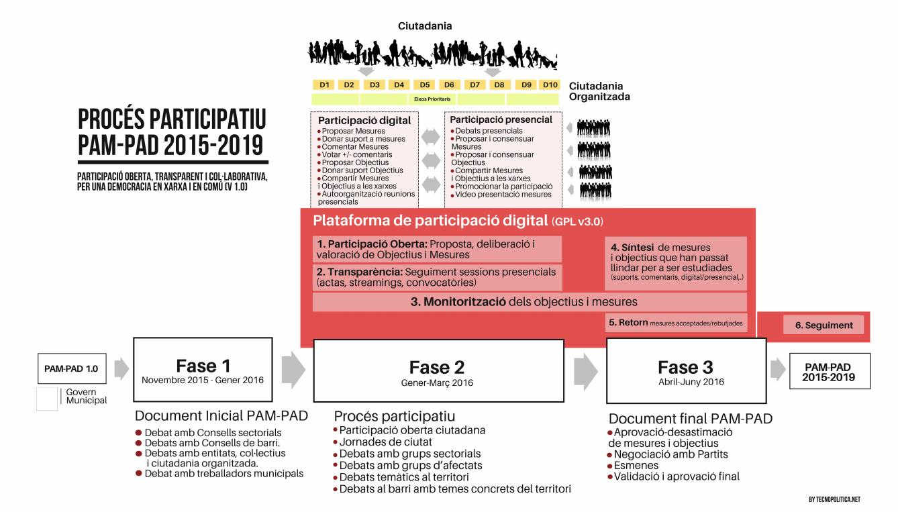
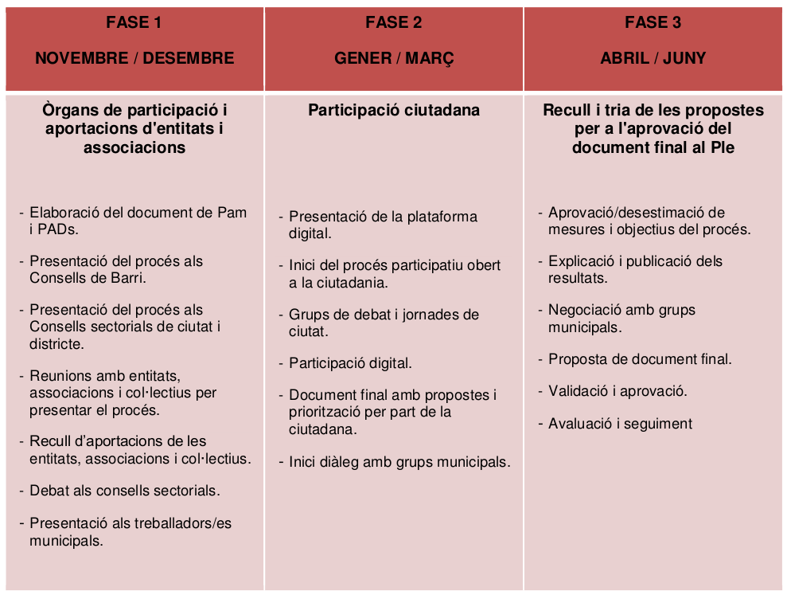

# Períodos o fases 

Inicialmente esta plataforma se utilizará para realizar propuestas de
medidas, comentarios o argumentos a favor o en contra de las mismas,
valorarlas de forma positivo o negativo y proponer objetivos nuevos.
Como se trata de un proceso con varias fases, la aplicación debe cambiar
de permisos y funcionalidades a lo largo del tiempo, así como tipos de
contribuciones (propuestas, argumentos, comentarios), votaciones, etc.
Se procede a detallar cada una de las fases en las que se dividirá el
proceso. .

El proceso de elaboración del PAM-PAD está diseñado en 4 fases
principales siendo la segunda fase (2) las más compleja y el resto de
fases hacen un uso parcial o limitado de la funcionalidad de esta fase
2.

*Mesura de govern. Procés participatiu per a l’elaboració del Programa
d’Actuació Municipal (PAM) i dels Programes d’Actuació dels Districtes (PAD) 2016-2019(2015) Ajuntament de Barcelona – Regidoria de Participació i Districtes  
http://premsa.bcn.cat/wp-content/uploads/2015/11/Presidencia-151118-Proces-participatiu-PAM-i-PADs.pdf *

## 1. Elaboración de la propuesta inicial

Esta fase concluirá con un documento que salga propuesto por el equipo
de gobierno, adaptado por parte de personal técnico del ayuntamiento.
Incluye reuniones participativas para elaborar la propuesta con
asociaciones, consejos o empresas públicas, privadas y cooperativas. En
esta fase lo importante es que la plataforma permita incluir el
contenido inicial (sobre el que partirá el resto de las contribuciones
al PAM-PAD) en las "fichas" de medidas.

Dentro de esta primera etapa se incluirá también información sobre las
personas/colectivos que han participado en su elaboración, para que
quede constancia (por motivos de transparencia y monitorización) de como
se ha desarrollado esta primera fase (con qué grado de
consenso/participación se ha realizado la primera propuesta).

En esta primera fase solo el personal técnico del ayuntamiento puede
introducir información pero siguiendo el mismo procedimiento que va a
seguir la ciudadanía en la fase 2. Hay que pensar qué tipo de autoría y
cuenta de usuaria será la responsable de subir esta semilla del PAM-PAD
y como queda eso reflejado en las medidas.

## 2. Apertura a participación ciudadana digital y presencial 

Esta es la fase más compleja, las especificaciones del siguiente
documento están pensadas para esta fase. Durante este período se
permitirá a la ciudadanía proponer medidas, votarlas, dar argumentos a
favor o en contra, así como proponer nuevos objetivos, etc.

Este periodo de participación va a tener una durada de dos meses, y va a
concentrar la mayor parte de la actividad participativa en la
plataforma.

## 3. Fase de negociación política

Fase de negociación política y re-elaboración del PAM-PAD con las
contribuciones, votos y comentarios de la ciudadanía. La participación
ciudadana se encuentra congelada, es decir no se permiten realizar
nuevas contribuciones.

La mayor parte de este proceso tendrá lugar de forma física (offline),
probablemente en plenos y/o comisiones de trabajo del ayuntamiento,
implicando a diferentes partidos políticos. Sabemos que es en esta fase
donde los lobbies intentan definir su influencia sobre el PAM-PAD y, en
general, es la parte que otros años ha sido más oscura y la que, en
principio (y desgraciadamente como norma), permite al equipo de gobierno
y los partidos ignorar propuestas ciudadanas, modificarlas o
desvirtuarlas. También es una fase en la que prima el realismo y pueden
intervenir y modificarse muchas propuesta para que puedan tener un
encaje general o una adaptación pragmática a las capacidad del
ayuntamiento, a los presupuestos, la normativa, etc.

Estando congelada ya la parte de participación ciudadana lo importante
de esta fase es poder informar, de manera transparente, de las
modificaciones realizadas y permitir a la ciudadanía monitorizar el
proceso, se trata de garantizar la trazabilidad de las influencias y
cambios en el documento (tanto en el contenido, como en los agentes que
realizan los cambios). En principio los partidos políticos pueden
influir y modificar propuestas en negociaciones directas con el equipo
de gobierno o a través de enmiendas. Estos procesos seguirán su curso
administrativamente regulado en el ayuntamiento (reuniones de consejos,
de grupos de trabajo municipal, plenos, etc.).

Hay que buscar una manera en la que se puedan volcar y reflejar estos
procesos en la plataforma (y así poder visualizar y monitorizar cambios
para poder también avisar de manera automatizada a la ciudadanía de las
modificaciones que se están realizando sobre las propuestas que han
elaborado o sobre aquellas que consideren importantes o en las que hayan
realizado comentarios, etc.). Para ello es esencial que la plataforma se
adapte mínimamente. Bastaría con congelar los comentarios normales y los
votos, y abrir una funcionalidad que incluya control de versiones de las
medidas y objetivos, así como las enmiendas propuestas. Los cambios en
las versiones debería de aparecer siempre justificados y aparecer
explícitamente (en forma de autoría o participación) quienes han
participado en la reelaboración de la nueva versión (partidos, personal
técnico/político del ayuntamiento y/o lobbies u otros agentes). Para las
enmiendas podría usarse estructura de comentarios, con autoría por
partidos y las votaciones en pleno reflejadas como votaciones de
usuarias (una vez mas partidos).

Finalmente las medidas y objetivos propuestos en las fase 2 podrán tener
un estado de Aceptado, Aceptado con modificaciones, Juntado con otras
medidas o objetivos o desestimados, para ser incorporado en el documento
final que se va a llevar en el Pleno Municipal para ser aprobado. Pero
sea cual sea el estado final cada una llevará una explicación sobre el
motivo por el que se asigna un estado o otro.

## 4. Documento final 

Idealmente debería de presentarse en la misma plataforma y permitir la
visibilización de la autoría de propuestas, el historial de cada medida,
las participación y el apoyo (o falta de apoyo) de los diferentes
partidos a cada una de las medidas y objetivos. Incluyendo estadísticas
de participación y una visualización gráfica de todo el proceso que ha
llevado a la versión final.

