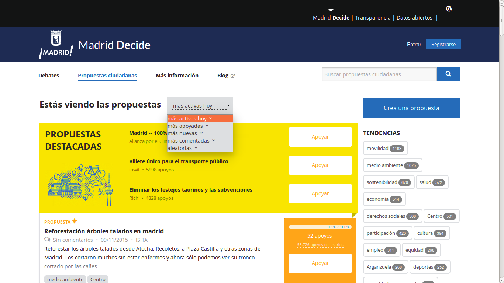

# Listado de propuestas

## Pantalla formato 1

El formato 1 de pantalla de “Propuestas”, sea para nivel municipio o
distrito, o por áreas (habría que definir si se crea una pantalla donde
puedan seleccionarse estas categorías previamente o si sólo aparecen
como opciones en la parte superior de la pantalla como desplegable)
presenta varios bloques consecutivos en el espacio. Estos criterios y
algoritmos deben ser modificables (más activas hoy, últimas agregadas,
mejor valoradas, más comentadas) con tres medidas cada uno. Al pulsar en
uno de esos grupos aparece una pantalla formato 2 (ver debajo).
Opcional: el orden de los bloques varía. Con esto se trata de minimizar
efectos de acumulación, por los cuales sólo un grupo, sea el de
propuestas más recientes, más votadas, etc. acumula la atención. Nota:
la pantalla Formato 1 requiere la pantalla formato 2, pero no a la
inversa.

## Pantalla formato 2

En el formato 2 de pantalla aparece una lista sólo del conjunto de
propuestas en función de lo seleccionado previamente, que se puede
re-seleccionar por categorías (municipio, distrito, área) y criterios
(más activas hoy, más nuevas, mejor valoradas, más comentadas,
aleatorias, últimas comentadas), con un desplegable (ej. imagen debajo)
que permite pasar a pantallas con el mismo formato de listado de
propuestas pero con listas creadas siguiendo otras categorías y
criterios . Discutir el criterio de la lista que aparece inicialmente
(más votadas, más activas hoy).

Se agrega una imagen de Madrid Decide para visualizar elementos a tener
en cuenta (tags, buscador, etc.)

