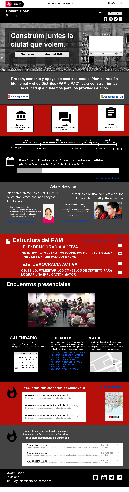

# Portada

Tiene que ser capaz de captar la complejidad del proceso (áreas,
jerarquía, etc.) la fase en la que estamos y las que faltan, etc. debe
tener una estructura "pedagógica" respecto a todo el PAM. Pero además la
página principal debe permitir la interacción directamente, osea hacer
propuestas y, sobre todo, votar las que ya existen, con un algoritmo que
muestre una selección de propuestas en función a diversos criterios, con
el objetivo de que todas las propuestas tengan visibilidad y posibilidad
de ser votadas, así como evitar la acumulacion sobre las que ya van más
votadas. Entre esos criterios se mostrarán:

-   las más discutidas
-   recién propuestas
-   las más votadas
-   combinación de criterios que den visibilidad a nuevas propuesta (las
    más candentes,...)

Igualmente el algoritmo debería de mostrar, cada vez que carga la página
principal, una variedad de las áreas (hacer la misma división tripartita
en función de las áreas: propuestas más votadas, más discutidas, recien
propuestas).

En el diseño inicial de la página inicial debe tenerse en cuenta lo
siguiente:

-   Debe tener un alto factor pedagógico donde se explique de qué se
    trata este proceso inicial de propuestas de medidas para el Programa
    d'Actuació Municipal y Plan de Acción de Distritos (PAM y PAD),
    sobre cómo se van a canalizar las propuestas de medidas y sus fases,
    verificación de los usuarios y votación de las medidas propuestas.
-   Debe tener un factor que permita la "participación, deliberación,
    decisión informada". Esto se refiere a que la ciudadanía no puede
    realizar propuestas ni tomar decisiones si no tiene la información
    mínima necesaria. Esta consistiría de enlaces a instituciones y
    bases de datos del ayuntamiento, con toda la información oficial
    potencialmente relevante (PAMs previos, presupuestos de concejalías,
    proyectos en curso, etc.) resulte, hasta cierto punto, accesible
    desde la plataforma. Es importante que quien quiera informarse antes
    de opinar y proponer pueda hacerlo y se le facilite materiales para
    ello (siquiera mínimamente).
-   Debe tener la posibilidad de crear una propuesta de medida
-   Debe tener la posibilidad de comenzar a leer y/o votar propuestas de
    medidas, tanto para el PAM general como para el PAD del distrito que
    corresponda segun su codigo postal, en caso de que haya una
    correspondencia clara entre códigos postales y distritos. Aun así
    permitirá ver las propuestas de otros distritos.  
-   Debe tener la posibilidad de adaptarse fácilmente, incluyendo
    algunos anuncios generales sobre el proceso. Por ejemplo:
 -   un video introductorio
 -   mensaje de la alcaldesa
 -   anuncios de que queda poco para la siguiente fase
 -   logros específicos de participación. Incluye enlace a otra pantalla
    en la que se visualiza: el proceso (estructura, calendario, etc.),
    principios del proceso y narrativas al respecto (que entendemos por
    participación, por qué es importante, etc.).

Como propuesta inicial se ha realizado la siguiente maqueta de forma que
sirva de propuesta inicial para su discusión.

Con respecto al Call to Action (hacer una propuesta), esta cambiaría en
función a la fase en la que nos encontremos y al momento en la misma.
Por ejemplo, al principio será interesante que la gente vea las
propuestas ya creadas en la fase 1, sobre todo para que no se repitan
mucho las que ya están creadas, y porque es una acción que al no
requerir la creación de un usuario tiene menos fricción. Más adelante se
puede modificar a "crear propuestas" si se quiere potenciar la
participación, o incluso se puede estudiar hacer pruebas A/B en las que
se ponen las dos acciones en simultáneo a un segmento de usuarios para
probar cual es la que funcione mejor.

Hay que tener en cuenta que mientras que la primera opción (hacer una
propuesta) incrementa la actividad de creación de propuestas y quizá la
originalidad, a costa de que sean meras opiniones poco reflexivas y haya
menos actividad evaluativa y de comunidad (comentarios, me gustas, etc),
la segunda opción (ver todas las propuestas) potencia la deliberación,
potencia la participación en comunidad y la evaluación, a riesgo de
generar pensamiento de grupo y disminuir el número total de propuestas.

