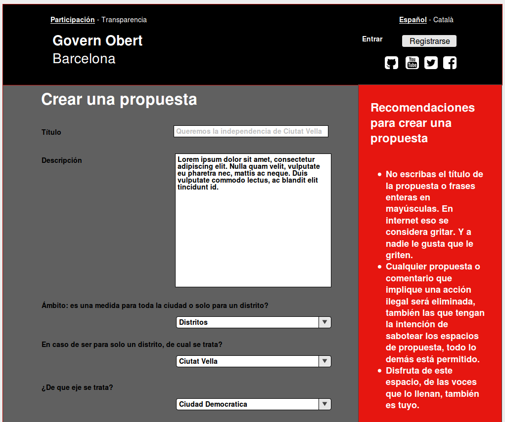
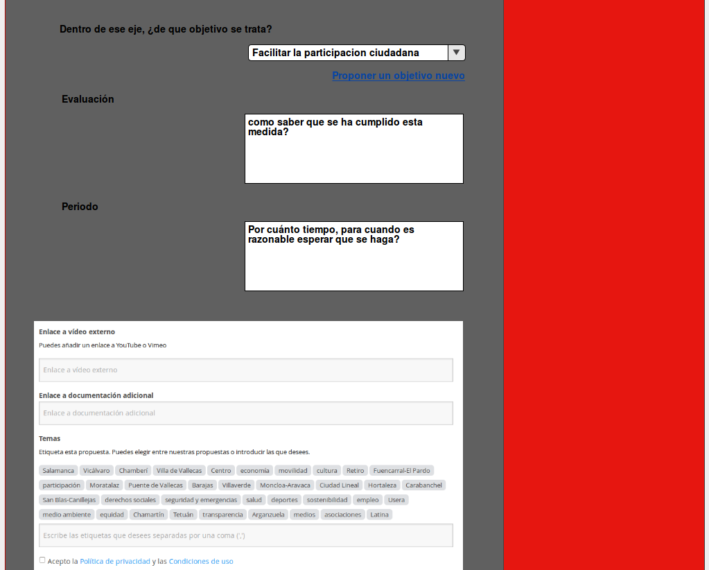
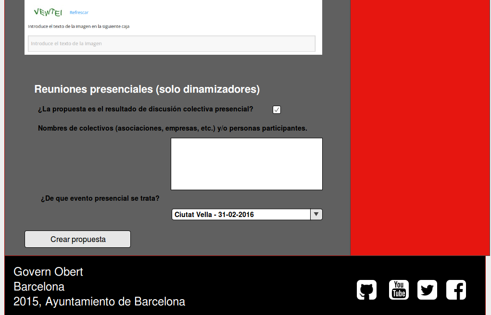
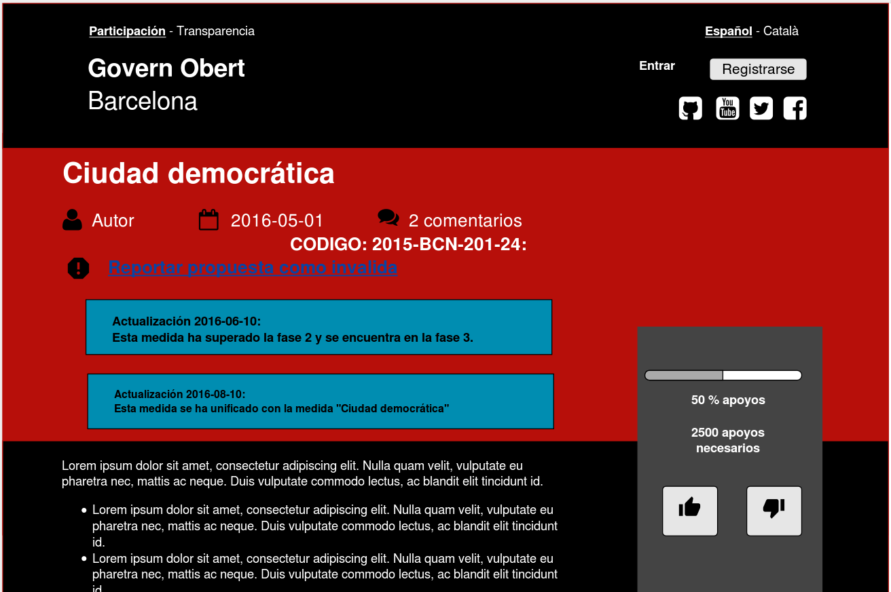
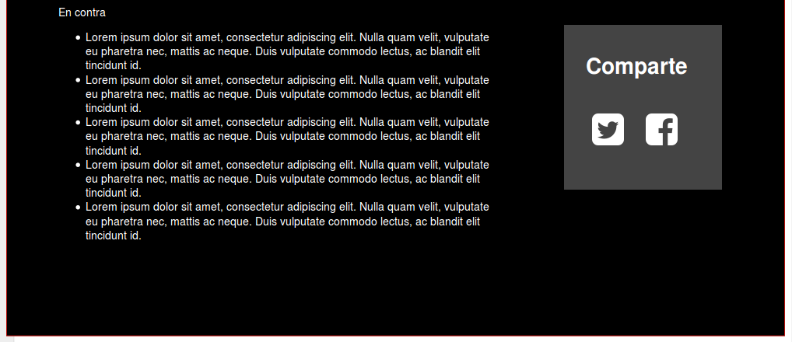
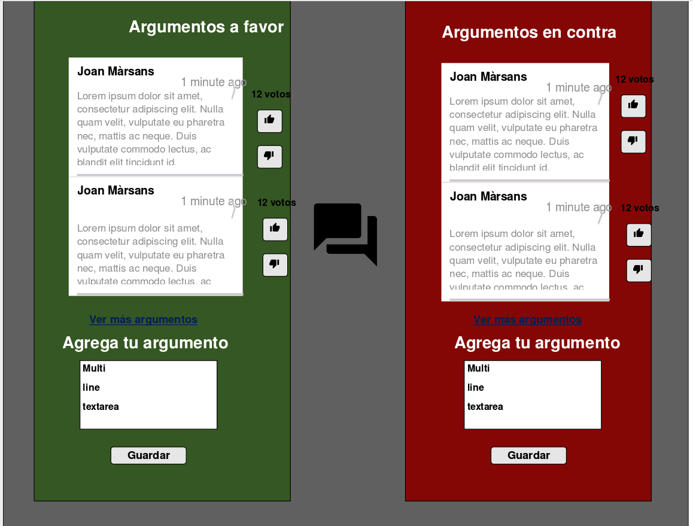

Propuestas (medidas y objetivos)
--------------------------------

Usamos el término propuestas como unidad básica de articulación de la
participación. En principio serán propuestas de medidas para el PAM
(Programa d'Actuació Municipal) y para el PAD (Plan de Acción de
Distritos). Una medida es una acción concreta evaluable en el tiempo.

Las propuestas están estructuradas en un sistema previamente propuesto
por equipos técnicos del ayto (consejos de distrito). Cada medida tendrá
la siguiente jerarquía:

1.  Escala: si es a nivel Municipal, de toda la ciudad/o específico a un
    Distrito, por ejemplo Ciutat Vella.
2.  Ejes (5 a escala de ciudad y 3 a escala de distrito). No son
    modificables. Los ejes son inalterables y distintos para PAM y PAD
    (y diferentes en cada distrito)
3.  Objetivos (pueden ser varios, dependera del eje). Se escogen bien de
    la lista de objetivos predefinidos o bien creados ex-novo para esa
    medida, o bien de otros objetivos que hayan creado otras
    usuarias. Los usuarios online y los usuarios dinamizadores podrán
    crear nuevos objetivos, pero siempre cuando estén creando una medida
    si no les encaja en los ya creados. Una medida siempre estará ligado
    a un único objetivo (1 a 1). Los objetivos tienen dos umbrales al
    igual que las propuestas (viabilidad técnica y umbral de votos para
    considerarse en la FASE III) el valor corresponderá a la suma de los
    votos de las medidas asociadas al objetivo

Las medidas (propuestas o contribuciones ciudadanas) realizadas por la
ciudadanía de forma presencial (offline) pueden tener más información
rellenada por parte del/los dinamizadores (contratados, no técnicos del
ayuntamiento) que coordinan una reunión colectiva de discusión.

Las medidas realizadas por la ciudadanía a través de Internet (online)
contarán con lo siguientes campos:

-   Obligatorios

 -   Título. Máximo 256 caracteres.

 -   Contenido propio de la propuesta. Máximo 1000 caracteres.

 -   Escala: si se trata de una medida general para la ciudad
    (perteneciente al PAM) o de una propuesta para un distrito en
    particular (perteneciente al PAD).

 -   Localización jerárquica (eje, objetivos). Cada medida tiene un
    Objetivo que a su vez tiene un Eje.

-   Opcionales

 -   Evaluación: texto libre. ¿Como saber que se ha cumplido esta medida?
 -   Periodo: texto libre. Por cuánto tiempo, para cuando es razonable
    esperar que se haga? Depende de si hay calendarios de
    implementación--como muy tarde--digamos--3 meses antes del fin de la
    legislatura.

 -   Tags (esto puede valer para otras clasificaciones además de la
    jerarquía).

 -   Video explicativo (2-3 minutos). (decidir si para todos los usuarios
    o sólo para dinamizadores de talleres presenciales)

 -   Referencias o enlaces para dar soporte a la propuesta, con ejemplos,
    referencias bibliográficas, otros modelos, etc. Solo se podrán
    introducir URLs.
 -   Autoría transferible, en el caso de que el autor lo quisiera, por
    diversos motivos (en caso de no tener tiempo para hacer el
    seguimiento, o crea que otra persona lo pueda hacer mejor), un
    usuario puede hacer una petición a los moderadores de que la autoría
    la lleve otro.

-   En caso de ser presencial: (resulta de un grupo de discusión o
    asamblea)

 -   Casilla que especifica que la propuesta es el resultado de discusión
    colectiva presencial.

 -   Espacio para añadir nombres de colectivos (asociaciones, empresas,
    etc.) y/o personas participantes.

 -   Enlace al evento de la reunión presencial, con todo lo que conlleva
    (acta de la sesión, número de participantes, etc).

Aparte de estos campos debe contar con las siguientes funcionalidades:

-   Histórico de versiones con todos los cambios realizados en la
    propuesta, si hay alguna otra relacionada, si se ha juntado con
    otra, si ha pasado de fase, etc.
-   Juntar propuestas: Para el desarrollo inicial permitiría que solo
    los moderadores/administradores pudieran iniciar el proceso de unir
    propuestas. Si se busca evitar posibles abusos y quejas en el
    sistema, debe tener cierta complejidad con respecto al proceso:\
    1- Un moderador encuentra dos propuestas similares.\
    2- Les envía un mensaje automático preguntando a los usuarios si
    están de acuerdo con que deberían juntarse.\
    3- El título y texto sería uno realizado por el moderador y aceptado
    por los ciudadanos.\
    3- Se juntarán los votos únicos de cada usuario recibida en cada
    propuesta.\
    4- Los comentarios se migrarán de forma automática, aunque luego
    pueda haber cierta duplicidad en los mismos se corregiría con el
    sistema de votación.\
    5- La autoría podría pasar a ser compartida, el moderador decide en
    función a cuánto aporta cada autor a la propuesta definitiva.\
    Como ya se ve, todo el proceso es complicado, sobre todo si se
    quiere evitar posibles quejas, y podría terminar a que se quede en
    un paso intermedio por falta de respuesta de alguno de los múltiples
    actores, pero es una idea de por dónde podría dirigirse esto. Se
    trataría de un desarrollo posterior. Puede ser más interesante en
    vez de desarrollar esto el hacer lo que se comenta de la
    Inteligencia Artificial que ya avise al usuario en el propio proceso
    de dar de alta una propuesta que hay alguna similar y que es mejor
    votar/comentar en las similares que crear decenas distintas.
-   Puntuación o votación de la propuesta. Los usuarios verificados
    pueden votar de forma positiva y negativa una propuesta. Tiene que
    existir la posibilidad de que las personas usuarias puedan cambiar
    el voto en función de la discusión.

-   Todos los usuarios deben poder considerar una propuesta como
    “Inapropiada” y denunciar a los moderadores.

-   Toda propuesta podrá tener varios argumentos. Que son comentarios,
    anidados y puntuables. Irán coloreados en función si la persona que
    ha hecho el comentario ha votado negativo o positivo a la propuesta,
    de este modo podemos organizar la discusión en razones en contra o a
    favor. Si la persona cambia su voto a la largo de la discusión, se
    mantiene el color del voto que dio al hacer el comentario (verde a
    favor, rojo en contra). Si la persona no ha votado o se mantiene
    escéptica o neutra, los comentarios van en gris. Los argumentos con
    mayor valoración (a favor o en contra) se pueden destacar (como
    meneame o de otro modo más gráfico---visualizar mediante una doble
    lista o panel izquierda--a favor, derecha--en contra, idealmente).
    Según el rol que tenga el usuario, se mostrará de distintas formas:

-   Debe distinguirse también en color especial comentarios de quien ha
    realizado la propuesta
-   Respuestas del personal técnico del ayto también podrían tener un
    color diferente

-   Listado (feed) de actualizaciones, donde se pondrán este tipo de
    datos que a lo largo del tiempo pueden ir mostrando cambios en su
    nivel de actividad, de fases, etc, al estilo de las
    "Actualizaciones" en las peticiones
    de [change.org](http://change.org).
    ("Esta propuesta ha superado 1000 votos" "Esta propuesta es una de
    las más populares" etc). También deberá de señalarse la fecha de la
    propuesta, la cantidad de comentarios, etc. (como la nano fisgona de
    meneame). También podemos añadir la fase en la que está y si ha
    pasado ya algún tipo de umbral.

-   No se podrán modificar las propuestas una vez realizadas, por
    problemas que puede haber relacionados con comentarios que se
    agreguen o votos que se realicen y luego se modifique la misma,
    cambiando el sentido del debate. En caso de querer modificar o
    mejorar una propuesta por su autora, deberá crear otra propuesta y
    luego proponer enlazarla, como cuando se propone combinar dos
    propuestas. El enlace final necesitará aprobación por moderación.
    Quizá dejen algún comentario al respecto, etc.
-   Identificador, generado de forma automática, con generación única,
    utilizando prefijos para que no colisionan con otros procesos
    participativos y sigan un formato homogéneo. Por ejemplo, para el
    caso de una propuesta del PAM 2015-BCN-PAM-10-1, 2015-BCN-PAM-10-2,
    etc.

Otras funcionalidades de las medidas/contribuciones:

-   Posibilidad de compartir la propuesta en redes sociales (Twitter,
    Facebook, Google +, en caso de ser un dispositivo movil tambien
    apareceran WhatsApp y Telegram)

-   En rojo o en verde dependiendo de si se llega a un umbral mínimo de
    "me gusta", "seguidores" o "asistentes".

-   Posibilidad de recibir actualizaciones sobre una propuesta (aunque
    no sea propia), hilo de debate, o evento.

-   Posibilidad de consultar las propuestas de otras
    participantes---para inspirarse, no repetir, etc. Enlace o
    desplegable en la misma pantalla en la que se redacta--- variable
    sobre la base de áreas-objetivos, palabras clave, etc. que introduce
    el usuario (algo similar ya esta implementado para el piloto interno
    del ayuntamiento).
-   Posibilidad de "sugerencias maquinicas"  mientras se
    redacta. Mostrar al usuario recomendaciones a través de una
    Inteligencia Artificial (SOLAR) que permita al usuario ver
    propuestas similares al momento de redactar el título o descripción
    de la misma.

-   Posibilidad de agrupar propuestas. Pensar sistema de crowdsourcing
    que minimice el trabajo posterior de estudio de las propuestas.
    Podríamos explorar algún tipo de IA que haga esto o que le proponga
    a una usuaria: crees que estas dos medidas son la misma? preguntas
    de este tipo que faciliten la inteligencia colectiva.

-   Se recoge con total claridad tanto las enmiendas como los vetos a
    propuestas que provengan de la fase de negociación entre partidos
    políticos (fase 3).

-   Trazabilidad ampliada. Posibilidad de suscribirse a una medida y ver
    sus cambios. Se recibirán todas las actualizaciones que estén
    relacionadas con cualquier fase de la misma. Por ejemplo si hago una
    propuesta, y se junta con otra, o si hago una propuesta y recibe un
    argumento en contra, o si la propuesta pasa a la fase 2, etc. La
    opción permitirá para recibir  actualizaciones sobre una determinada
    medida en la negociación política  y tras la aprobación del PAM.
    Actualizaciones para: 1-informar sobre  (variaciones en) estado (sin
    iniciar, en desarrollo, realizado); 2-invitación a colaborar
    (medio-largo plazo);  3-evaluación técnica y ciudadana (?). Estudiar
    poner diferentes niveles de actividad que se quiera recibir, por
    ejemplo solo de la propuesta en general (e incluiría lo que se cita
    aquí) o también todos los comentarios que se generan durante la Fase
    II.
