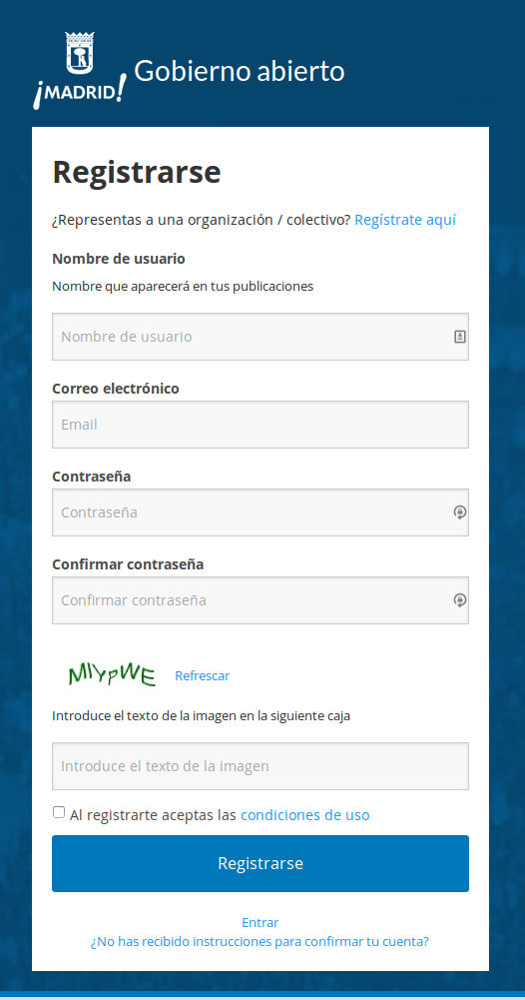
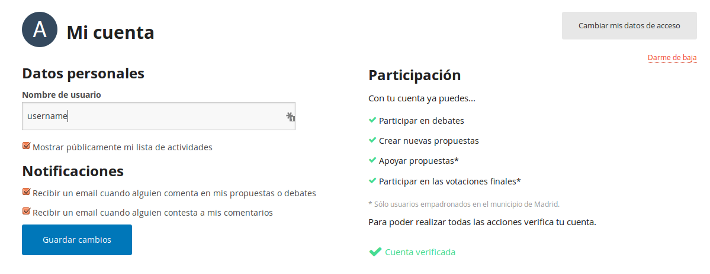

# Registro y verificación de usuarias

La aplicación debe permitir un registro y autenticación básica segura de
usuarias. Dicho registro contará con varios pasos:

## 1° paso: Registro de cuenta

Es el permiso inicial básico que se le pide a todos los usuarios de la
plataforma. Permite proponer medidas y debates, así como agregar
comentarios, pero no permite votación de medidas.

Los campos que se piden en el formulario de registro son:

-   Nombre usuaria (una sola palabra--no tiene porque ser nombre real)

-   Correo electrónico (email)

-   Contraseña (password), repetir contraseña.

Para detener ataques automatizados de creación masiva de usuarios, debe
rellenar un captcha.

Para detener ataques automatizados de creación masiva de usuarios, se
debe comprobar el correo electrónico a través de un enlace que se envíe
al mismo que el usuario deba visitar. Hasta no haber finalizado la
comprobación del correo electrónico no podrá iniciar sesión.

En el futuro y como opcional, debe tener la posibilidad de registrarse
vía Facebook, Gmail, Twitter, OpenID (opcional)

Debe permitirse recuperar la contraseña y reenviar el correo de
confirmación.

El usuario debe aceptar unas condiciones de uso.

Al ser un proceso tan básico y que siempre se piden los mismos datos, se muestra 
como ejemplo un pantallazo de este paso tomado de [Madrid Decide](https://decide.madrid.es/).

## 2° paso: Verificación

Para detener ataques automatizados de votaciones, se requerirá una
verificación del usuario, comprobando que se trate de una persona real.
Al obtener este permiso permite votar medidas.

Debe comprobar a través del padrón los datos que identifican a la
persona y que viva en Barcelona (o su área metropolitana o criterio
similar, ver discusión debajo). Estos datos deben ser:

-   número de documento
-   tipo de documento (DNI, pasaporte o tarjeta de residencia)
-   fecha de nacimiento
-   código postal (CP).

A fines estadísticos se guardaron los datos de fecha de nacimiento y
código postal, con el objetivo de poder obtener métricas de
participación por edad y ubicación geográfica. Obteniendo el CP ya se
obtiene a que Distrito y Barrio pertenece este ciudadano.

La necesidad de verificar a los usuarios para dar mayor visibilidad a
sus propuestas radica en que si no se producen ataques generalizados por
comunidades de Internet. Se propone tanto verificar usuarios como poder
denunciar comentarios que violen las normas de uso del sitio. Como
ejemplo de que puede ocurrir en votaciones a través de Internet si no se
implantan este tipo de medidas se puede ver aquí:

-   http://verne.elpais.com/verne/2015/09/08/articulo/1441714991\_760971.html
-   http://content.time.com/time/arts/article/0,8599,1894028,00.html

Barcelona tiene una problemática particular ya que mucha de la gente que
se encuentra allí a diario y que quisiera participar en estos mecanismos
no se encuentra empadronada allí, por lo que se propone otros criterios
de “pertenencia” a la ciudad que no sean necesariamente solo el estar
empadronado. Como alternativas se piensan:

-   Verificación acudiendo a punto de identificación presencial (Sede de
    distrito, centros cívicos, de cultura, etc.). Faltaría definir aquí
    el criterio que se utilizará: tarjeta de estudiante, de autobús,
    DNI, contrato, etc. También habría que tener criterios para la gente
    que no lo pueda demostrar (inmigrantes sin papeles).
-   ¿Ciudadanos empadronados en el Área metropolitana de Barcelona?

A falta de definir este proceso con detalle, la interfaz gráfica y el flujo de un
usuario será similar al seguido por [Madrid Decide](https://decide.madrid.es/).

## 3° paso (opcional). Completar perfil de usuaria

A fines estadísticos, se pueden pedir otros datos:

-   Sexo/Género (poner posibilidad de neutro)
-   Parámetros económicos (a definir) (igual no hace falta por tener el
    CP en el 2° paso?)
-   Parámetros educativos (a definir)
