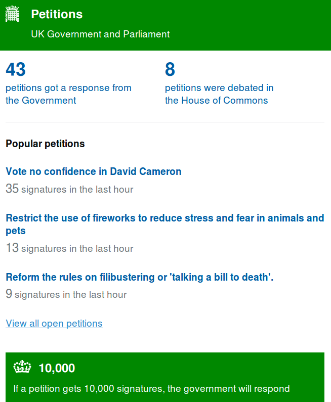

# e-Petitions Gov.UK

 - [URL](https://petition.parliament.uk/)
 - [Còdigo]()
 -
## Descripción

Es la plataforma web para llevar propuestas al Gobierno y Parlamento de UK. 

## Características

-   

## Argumentos

### A favor

-   Licencia GPL Affero 3 
-   Tanto el lenguaje de programación (Ruby), el framework de desarrollo (Ruby On Rails), el sistema operativo (Linux) y la base de datos (PostgreSQL) son completamente libres. 
-   Permite la colaboración externa en la rama principal de desarrollo. 
-  Cuenta tanto con suite de tests como servicios externos de control de calidad ya integrados. 
-  El desarrollo es completamente abierto y libre desde el primer momento. 
-  Cuenta ya con internacionalización (en Castellano e Inglés), por lo que se ahorraría mucho tiempo en este trabajo que suele ser tedioso y llevar bastante tiempo durante el desarrollo.
-  Tiene un sistema de registro de usuarios que permite su verificación a través de correo electrónico, así como de la API del padrón y a través de SMS. Cuenta con un sistema de permisos similar al necesario por las especificaciones.  
-   Ya tiene un modelo base extensible de Propuestas, Comentarios, etc. 
-   Aplica el principio de Kerckhoffs en materia de seguridad de configuraciones. Ya se encuentra revisada por la comunidad y no se han encontrado fallos de seguridad. 
-   Cuenta con funcionalidades de denuncia y moderación de las propuestas y comentarios. 

### En contra

-   Su documentación es mejorable. Sólo tiene unas instrucciones muy básicas para hacerlo funcionar, pero sigue los estándares y convenciones de Ruby On Rails por lo que es prescindible. 
-   Se encuentra en pleno desarrollo, por lo que será necesario coordinarse con los desarrolladores originales para ver la mejor forma de contribuir y cuales (y como) de nuestras funcionalidades se podrían subir a la versión del Ayuntamiento de Madrid. Esto podría evitarse en los primeros meses de prueba del software hasta tener un entendimiento mayor del mismo.
-   La tecnología con la que está realizada, el lenguaje y framework de programación, no son unas en las que se encuentre familiarizados los programadores del IMI. Aunque se trate de tecnologías con conceptos similares a las que se utilizan internamente (Python y Django), aún así hace falta un tiempo de aprendizaje.

## Pantallazos

