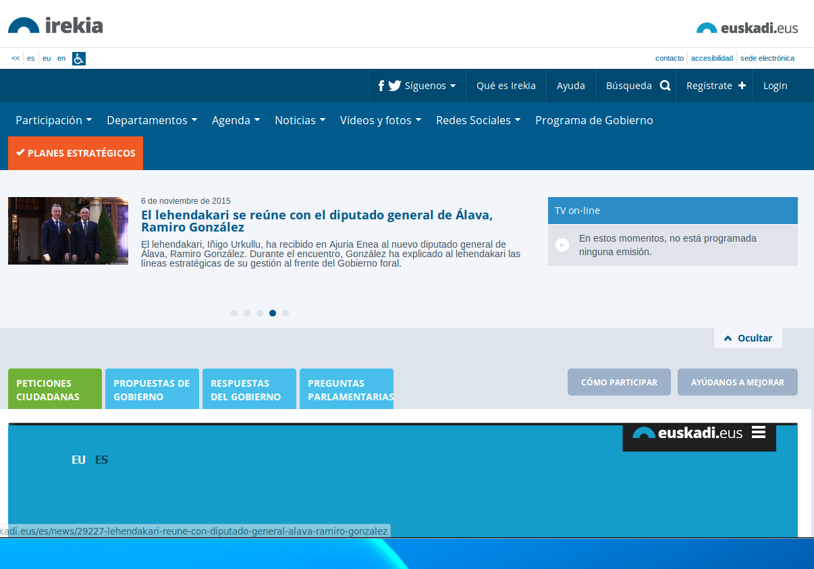
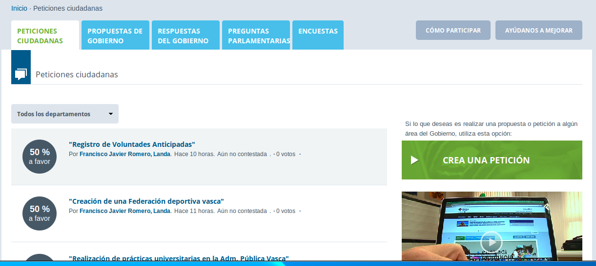
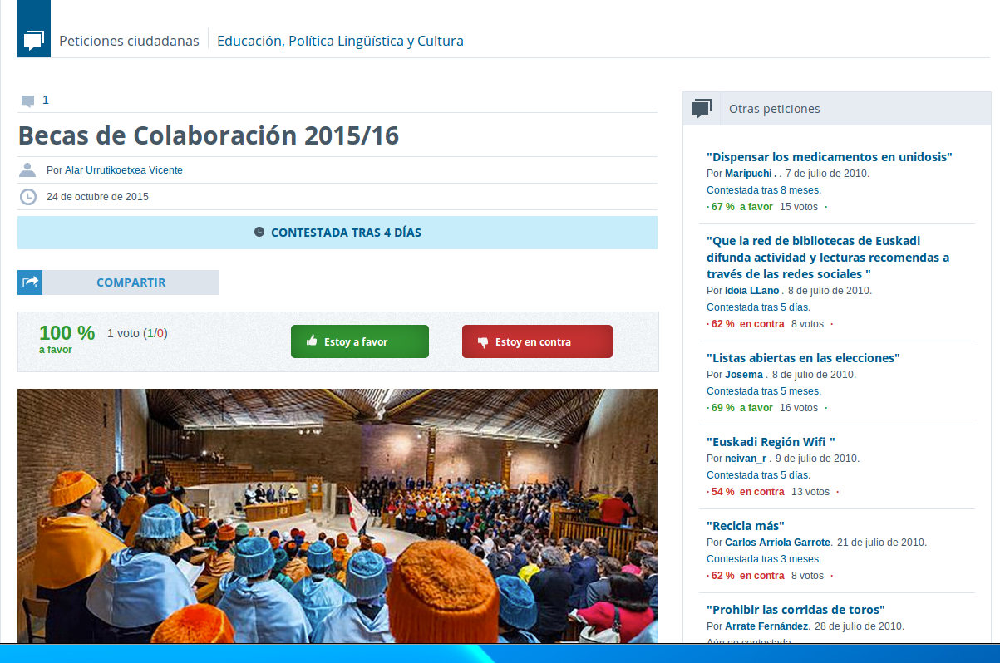
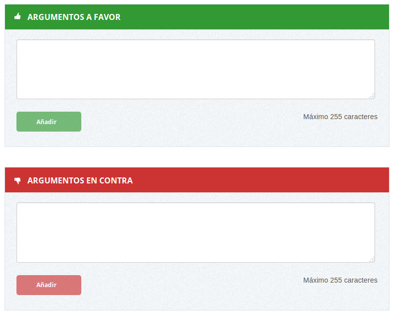
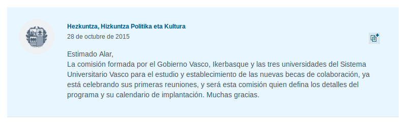

# Open Irekia
 
 - [URL](http://www.irekia.euskadi.eus/)
 - [Còdigo]()
 -
## Descripción

Es la plataforma web de participación del gobierno vasco. Cuenta con
funcionalidades tanto de participación de parte de la ciudadanía (bottom
up) como propuestas por parte de la institución (top down).

## Características

-   

## Argumentos

### A favor

-   Licencia GPL Affero 3 
-   Tanto el lenguaje de programación (Ruby), el framework de desarrollo (Ruby On Rails), el sistema operativo (Linux) y la base de datos (PostgreSQL) son completamente libres. 
-   Cuenta con una documentación extensiva.
-   Cuenta ya con internacionalización (en Castellano y Vasco), por lo que se ahorraría mucho tiempo en este trabajo que suele ser tedioso y llevar bastante tiempo durante el desarrollo.
-   Ya tiene un modelo base extensible de Propuestas, Comentarios, etc. 
-   Aplica el principio de Kerckhoffs en materia de seguridad de configuraciones. Ya se encuentra revisada por la comunidad y no se han encontrado fallos de seguridad. 

### En contra

-   Las capacidades de CMS con las que cuenta son muy reducidas. Su panel de administrador es muy básico, no permite subir ni fotos ni videos. 
-   Se encuentra en pleno desarrollo, por lo que será necesario coordinarse con los desarrolladores originales para ver la mejor forma de contribuir y cuales (y como) de nuestras funcionalidades se podrían subir a la versión del Ayuntamiento de Madrid. Esto podría evitarse en los primeros meses de prueba del software hasta tener un entendimiento mayor del mismo.
-   La tecnología con la que está realizada, el lenguaje y framework de programación, no son unas en las que se encuentre familiarizados los programadores del IMI. Aunque se trate de tecnologías con conceptos similares a las que se utilizan internamente (Python y Django), aún así hace falta un tiempo de aprendizaje.
-   No permiten de forma clara la colaboración externa en la rama principal de desarrollo, ni cuentan con gestor de tickets público ni acceso al repositorio en el sistema de control de versiones que se utilice. La liberación del código consiste en subir un fichero .zip cada año aproximadamente. 
-   No cuenta con servicios externos de control de calidad. 

## Pantallazos

