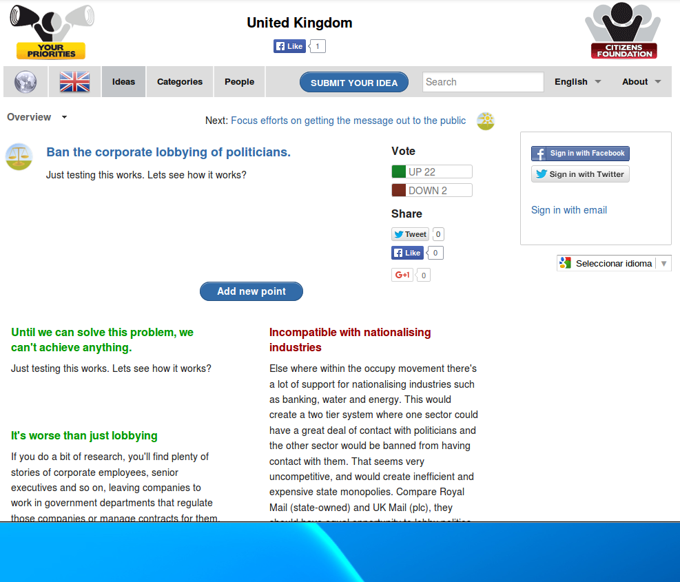

# Your Priorities
 
 - [URL](https://www.yrpri.org/home/world)
 - [Còdigo]()
 -
## Descripción

Es la plataforma web de votación de propuestas creada en Islandia. Se ha utilizado para enviar propuestas al gobierno de Reykjavik desde el 2011. 

## Características

-   

## Argumentos

### A favor

-   Licencia GPL Affero 3 
-   Tanto el lenguaje de programación (Ruby), el framework de desarrollo (Ruby On Rails), el sistema operativo (Linux) y la base de datos (PostgreSQL) son completamente libres. 
-   Cuenta con una documentación extensiva.
-   Cuenta ya con internacionalización (en Inglés y otros idiomas), por lo que se ahorraría mucho tiempo en este trabajo que suele ser tedioso y llevar bastante tiempo durante el desarrollo.
-   Ya tiene un modelo base extensible de Propuestas, Comentarios, etc. 
-   Aplica el principio de Kerckhoffs en materia de seguridad de configuraciones. Ya se encuentra revisada por la comunidad y no se han encontrado fallos de seguridad. 

### En contra

-   No cuenta con servicios externos de control de calidad. 
-   No cuenta con una suite extensiva de tests que sirva de control de calidad. 
-   La tecnología con la que está realizada, el lenguaje y framework de programación, no son unas en las que se encuentre familiarizados los programadores del IMI. Aunque se trate de tecnologías con conceptos similares a las que se utilizan internamente (Python y Django), aún así hace falta un tiempo de aprendizaje.
-   No permiten de forma clara la colaboración externa en la rama principal de desarrollo, ni cuentan con gestor de tickets público ni acceso al repositorio en el sistema de control de versiones que se utilice. La liberación del código consiste en subir un fichero .zip cada año aproximadamente. 
-   No incorpora respuestas por parte de los moderadores. 

## Pantallazos

